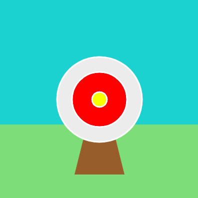

`stroke()` يضبط اللون الذي سيتم استخدامه للاطار حول الأشكال. تمامًا مثل `fill()`، تنطبق دالة `stroke()` على كل ما يتم رسمه بعد تسميته، لذا ستحتاج إلى إضافة التعليات البرمجية `stroke()` في كل مرة تريد فيها تغيير لون الحد.

لإزالة الاطار تمامًا، أضف `no_stroke()` قبل رسم الشكل (الأشكال).

يمكن التحكم في سماكة الاطار باستخدام `stroke_weight()`

يحتوي هذا المثال على `no_stroke()` للسماء والعشب والمنصة البنية، ثم يتغير إلى `stroke(WHITE)` `stroke_weight(3)` لرسم الدوائر المستهدفة.

--- code ---
---
language: python
filename: main.py - draw()
---

    no_stroke()  # removes borders
    fill(BLUE)  # sky
    rect(0, 0, 400, 250)
    fill(GREEN)  # grass
    rect(0, 250, 400, 150)
    fill(BROWN) 
    triangle(150, 350, 200, 150, 250, 350)  #stand
    stroke(WHITE)  # A white outline
    stroke_weight(3)  # A thick outline
    fill(GREY)
    ellipse(200, 200, 170, 170)  # Outer circle
    fill(RED)
    ellipse(200, 200, 110, 110)  # Inner circle
    fill(YELLOW)
    ellipse(200, 200, 30, 30)  # Bullseye

--- /code ---

