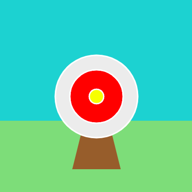

`stroke()` (trazo) fija el color de los bordes alrededor de las formas. Al igual que `fill()` la función `stroke()` se aplica a todo lo que dibujas después de llamarla, así que tendrás que agregar código `stroke()` cada vez que quieras cambiar el color del trazo.

Para eliminar los bordes por completo, puedes agregar la función `no_stroke()` antes de dibujar tu(s) forma(s).

Para aumentar o disminuir el grosor del borde puedes usar `stroke_weight()`

El ejemplo a continuación utiliza `no_stroke()` para el cielo, el pasto y el soporte marrón, luego cambia a `stroke(WHITE)` `stroke_weight(3)` para dibujar los círculos del tablero de tiro al blanco.

--- code ---
---
language: python
filename: main.py - draw()
---

  no_stroke() # elimina los bordes 
  fill(BLUE) # fija el color del cielo 
  rect(0, 0, 400, 250) 
  fill(GREEN) # fija el color del pasto 
  rect(0, 250, 400, 150) 
  fill(BROWN) 
  triangle(150, 350, 200, 150, 250, 350)  # soporte marrón 
  stroke(WHITE) # Para un contorno blanco 
  stroke_weight(3) # Para un contorno grueso 
  fill(GREY) 
  ellipse(200, 200, 170, 170) # Círculo exterior del tablero de tiro al blanco 
  fill(RED) 
  ellipse(200, 200, 110, 110) # Círculo interior del tablero de tiro al blanco 
  fill(YELLOW) 
  ellipse(200, 200, 30, 30) # La diana del tablero de tiro al blanco

--- /code ---

